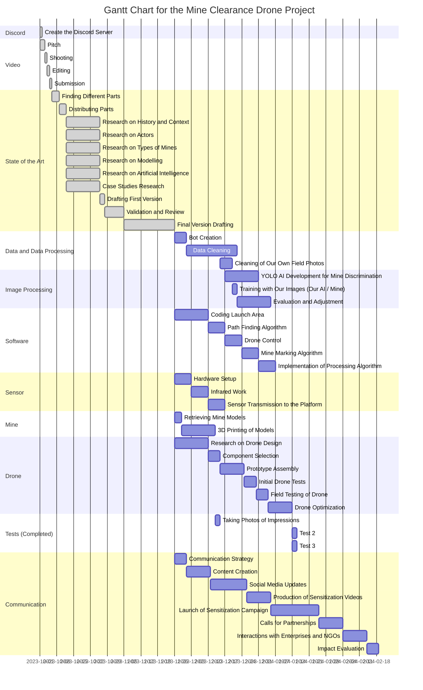

See the Gantt chart below for the project timeline. The chart is also available in [PDF](./gantt.pdf) format.

```mermaid
gantt
    title Gantt Chart for the Mine Clearance Drone Project

    dateFormat  DD-MM-YYYY
    section Discord
    Create the Discord Server              :done, discord, 01-10-2023, 1d

    section Video
    Pitch                                  :done, vid1, 01-10-2023, 2d
    Shooting                               :done, vid2, after vid1, 1d
    Editing                                :done, vid3, after vid2, 1d
    Submission                             :done, vid4, after vid3, 1d

    section State of the Art
    Finding Different Parts                :done, ea1, after vid4, 3d
    Distributing Parts                     :done, ea2, after ea1, 3d
    Research on History and Context        :done, ea3, after ea2, 14d
    Research on Actors                     :done, ea4, after ea2, 14d
    Research on Types of Mines             :done, ea5, after ea2, 14d
    Research on Modelling                  :done, ea6, after ea2, 14d
    Research on Artificial Intelligence    :done, ea7, after ea2, 14d
    Case Studies Research                  :done, ea8, after ea2, 14d
    Drafting First Version                 :done, ea9, after ea8, 2d
    Validation and Review                  :done, ea10, after ea9, 8d
    Final Version Drafting                 :done, ea11, after ea10, 3w

    section Data and Data Processing
    Bot Creation                           :db1, after ea11, 5d
    Data Cleaning                          :db2, after db1, 3w
    Cleaning of Our Own Field Photos       :db3, after t2, 5d

    section Image Processing
    YOLO AI Development for Mine Discrimination :ti1, after cs3, 2w
    Training with Our Images (Our AI / Mine)    :ti2, after db3, 2d
    Evaluation and Adjustment                    :ti3, after ti2, 2w

    section Software
    Coding Launch Area                     :s1, after ea11, 2w
    Path Finding Algorithm                 :s2, after s1, 1w
    Drone Control                          :s3, after s2, 1w
    Mine Marking Algorithm                 :s4, after s3, 1w
    Implementation of Processing Algorithm :s5, after s4, 1w

    section Sensor
    Hardware Setup                         :cs1, after ea11, 1w
    Infrared Work                          :cs2, after cs1, 1w
    Sensor Transmission to the Platform    :cs3, after cs2, 1w

    section Mine
    Retrieving Mine Models                 :m1, after ea11, 3d
    3D Printing of Models                  :m2, after m1, 2w

    section Drone
    Research on Drone Design               :dr1, after ea11, 2w
    Component Selection                    :dr2, after dr1, 5d
    Prototype Assembly                     :dr3, after dr2, 10d
    Initial Drone Tests                    :dr4, after dr3, 5d
    Field Testing of Drone                 :dr5, after dr4, 5d
    Drone Optimization                     :dr6, after dr5, 10d

    section Tests (Completed)
    Taking Photos of Impressions           :t2, after m2, 2d
    Test 2                                 :t3, after dr6, 2d
    Test 3                                 :t4, after dr6, 2d

    section Communication
    Communication Strategy                 :com2, after ea11, 5d
    Content Creation                       :com3, after com2, 10d
    Social Media Updates                   :com4, after com3, 15d
    Production of Sensitization Videos     :com7, after com4, 10d
    Launch of Sensitization Campaign       :com5, after com7, 20d
    Calls for Partnerships                  :com8, after com5, 10d
    Interactions with Enterprises and NGOs :com9, after com8, 10d
    Impact Evaluation                      :com6, after com9, 5d
```