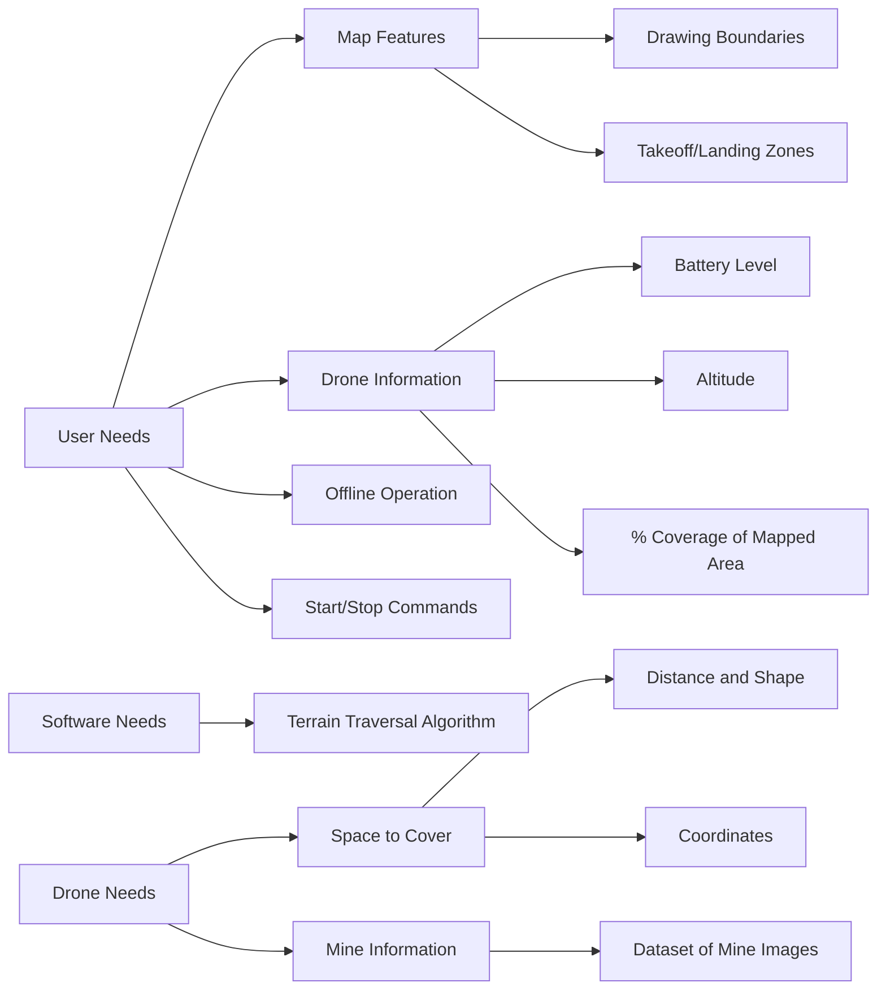
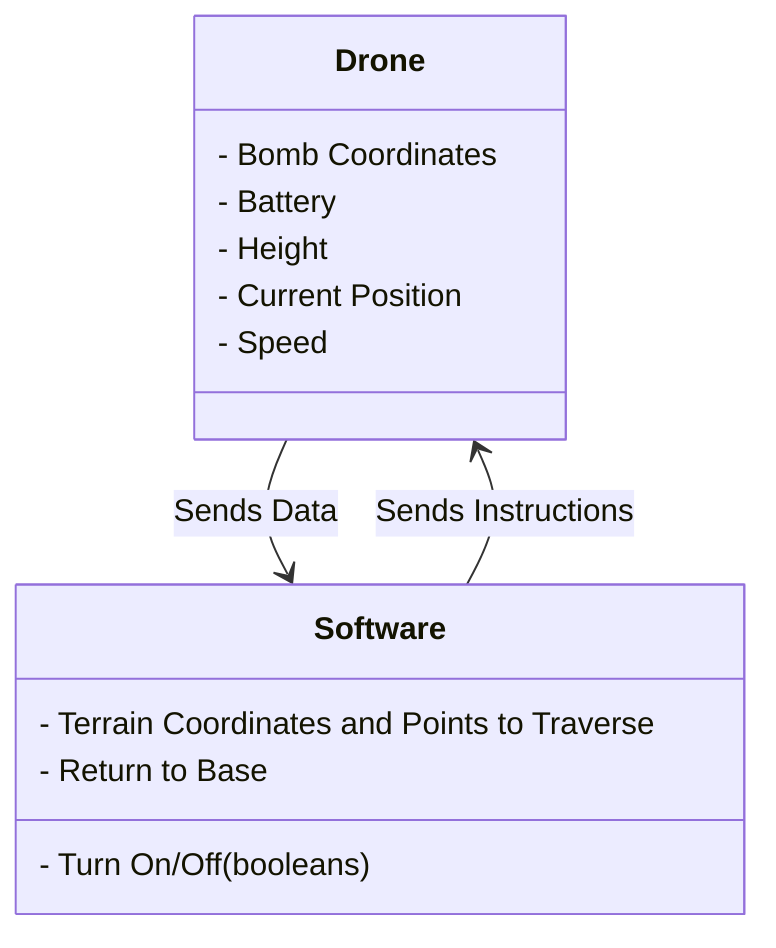

# Brain Storme 🧠

This doc is the premise of the project. It will be used to brainstorm ideas and concepts.

## Constraints

```mermaid
graph LR
    UserNeeds[User Needs] --> Maps[Map Features]
    Maps --> DrawingBoundaries[Drawing Boundaries]
    Maps --> TakeoffLandingZones[Takeoff/Landing Zones]
    UserNeeds --> DroneInfo[Drone Information]
    DroneInfo --> BatteryLevel[Battery Level]
    DroneInfo --> Altitude[Altitude]
    DroneInfo --> CoveragePercent[% Coverage of Mapped Area]
    UserNeeds --> OfflineOperation[Offline Operation]
    UserNeeds --> StartStopCommands[Start/Stop Commands]

    SoftwareNeeds[Software Needs] --> TerrainAlgorithm[Terrain Traversal Algorithm]

    DroneNeeds[Drone Needs] --> SpaceDetails[Space to Cover]
    SpaceDetails --> DistanceShape[Distance and Shape]
    SpaceDetails --> Coordinates[Coordinates]
    DroneNeeds --> MineInfo[Mine Information]
    MineInfo --> MineImagesDataset[Dataset of Mine Images]
```

## Data Class

```mermaid
classDiagram
    class Drone {
        - Bomb Coordinates
        - Battery
        - Height
        - Current Position
        - Speed
    }

    class Software {
        - Terrain Coordinates and Points to Traverse
        - Turn On/Off (booleans)
        - Return to Base
    }

    Drone --> Software: Sends Data
    Software --> Drone: Sends Instructions
```